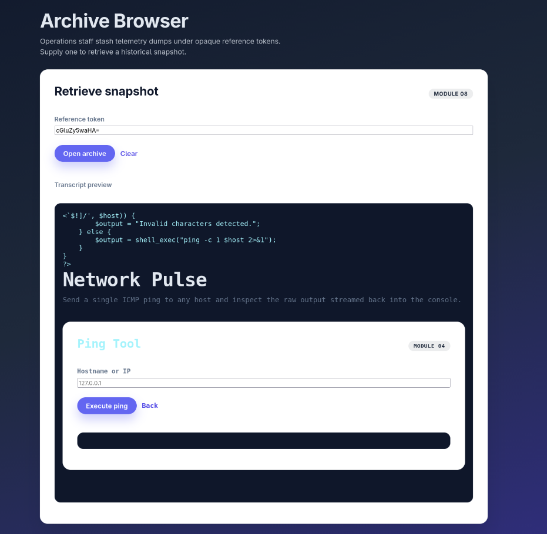

### vulnerabilities:
1.`' OR '1'='1` can be used as a username and a password in order to bypass login screen in `login.php`
2 `cGluZy5waHA=` you can pick the b64 encoding of any file name and leak it (which you could definitely brute force) it will render incorrectly `archive.php`
-  one problem with this is that users can abuse the "../../" characters we need to validate that
- we also need to wrap the $transcript with htmlspecialchars()
``` 
<?php if ($transcript !== null && $transcript !== false): ?>
    <div class="stack" style="margin-top:18px;">
      <span class="input-label">Transcript preview</span>
      <pre><?= htmlspecialchars($transcript, ENT_QUOTES, 'UTF-8') ?></pre>
    </div>
<?php endif; ?>
```

3. `search.php` line 23 also prone to the injection  `' OR '1'='1` will list every user out there and you can look at their password
4. Everyone's passwords could be viewed through user.php

5. You can inject `127.0.0.1; echo himom; ls -l` and pretty much follow it with any command in `ping.php` 


ZmxpZ2h0LW9wcy50eHQK is the right input into archive to access logs/flightops.txt