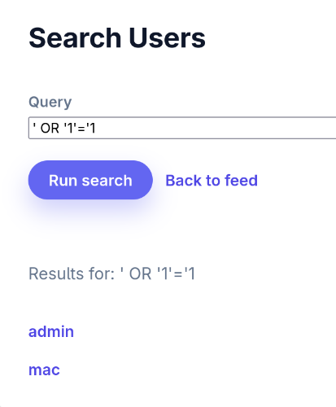

### vulnerabilities:
1.`' OR '1'='1` can be used as a username and a password in order to bypass login screen in `login.php`
2 `cGluZy5waHA=` you can pick the b64 encoding of any file name and leak it (which you could definitely brute force) it will render incorrectly

3. `search.php` line 23 also prone to the injection  `' OR '1'='1` will list every user out there and you can look at their password

4. `' OR '1'='1; DROP TABLE;`  can once again be used for register.php //not working yet
5. You can inject `127.0.0.1; echo himom; ls -l` and pretty much follow it with any command in `ping.php` 

ZmxpZ2h0LW9wcy50eHQK is the right input into archive